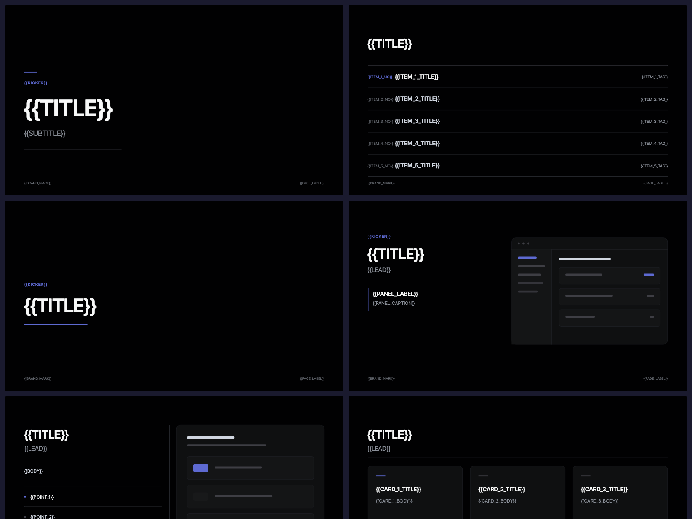
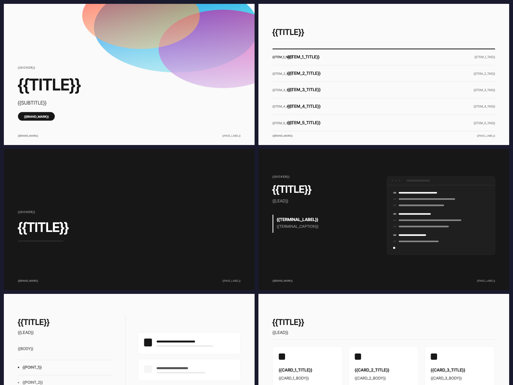
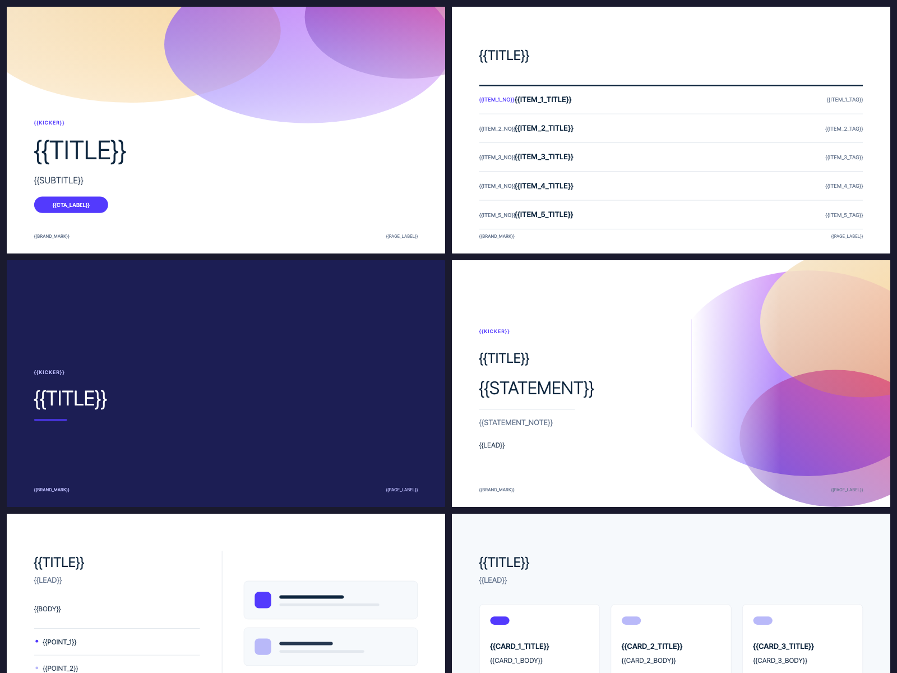
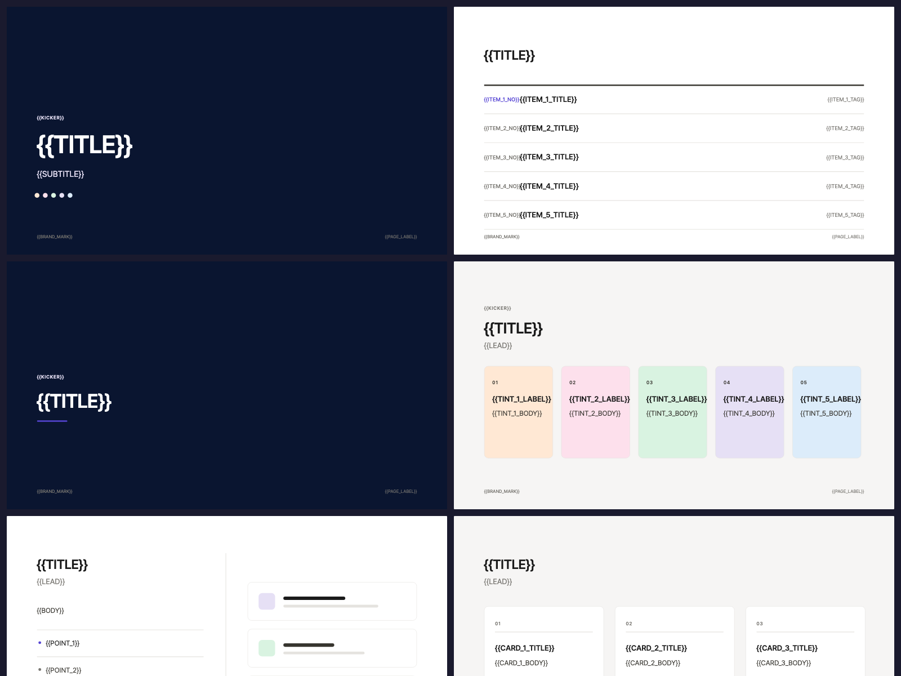
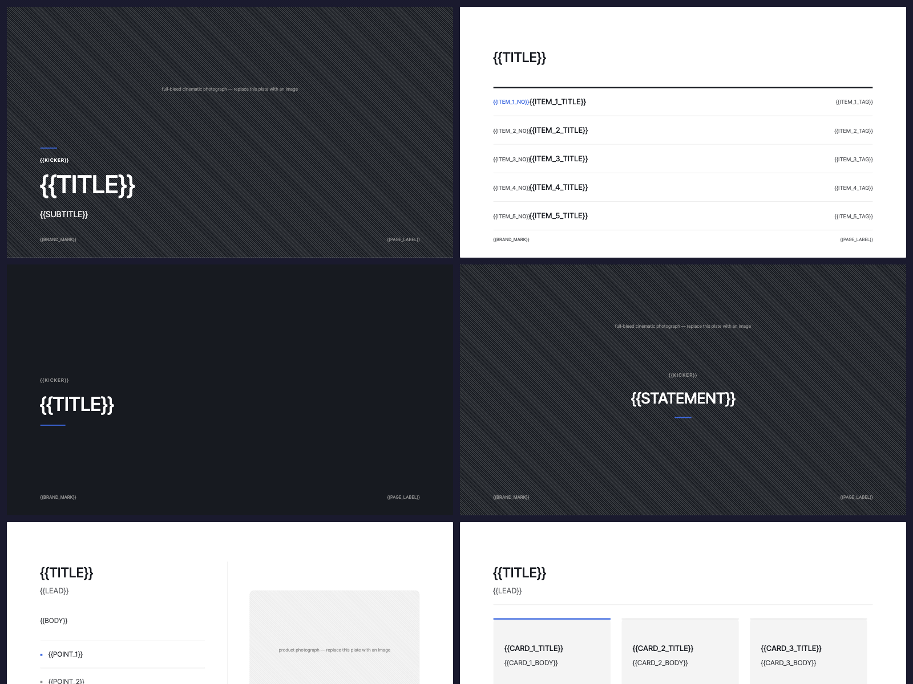
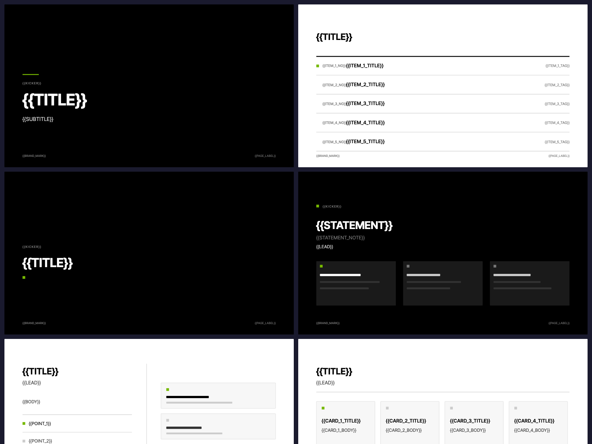

# Deck Design Pack

Six original 16:9 presentation template systems for [ppt-master](https://github.com/hugohe3/ppt-master)-compatible workspaces — the SVG-authoring pipeline that turns source documents into natively editable PowerPoint decks.

Each template ships **10 hand-authored SVG page prototypes** plus a full design specification, and compiles to a real PowerPoint Master/Layout structure — not a flattened picture deck.

```
6 templates · 60 SVG prototypes · 6 identity-only brand presets
0 errors / 0 warnings on the structural checker
all six verified end to end: generated deck → export → verify_deck PASS
```

---

## The six

| Template | Theme | Primary | Signature move | Best for |
|---|---|---|---|---|
| **[Midnight Panel](decks/midnight-panel/)** | dark | `#5E6AD2` | Surface stepping instead of shadow; one lavender signal per page | Product roadmaps, sprint reviews, engineering briefings |
| **[Polarity Mono](decks/polarity/)** | light ↔ dark | `#171717` | Chapter breaks are a **polarity inversion**, not a divider | Tech talks, demo days, developer conferences |
| **[Gradient Mesh Fintech](decks/gradient-mesh/)** | light | `#533AFD` | Mesh gradient over thin 300-weight display type | Partner proposals, fintech IR, product economics |
| **[Warm Document](decks/warm-doc/)** | warm light | `#5645D4` | 1px outline grammar, five pastel tint cards | Handbooks, onboarding, team wiki decks |
| **[Open Road](decks/open-road/)** | light + carbon | `#3E6AE1` | One page, one message; full-bleed photography | Product launches, brand keynotes, vision decks |
| **[Signal Green](decks/signal-green/)** | black / white | `#76B900` | 12×12 corner-square marker; angular 2px geometry | AI/GPU briefings, benchmarks, developer sessions |

Every template also ships an **identity-only brand preset** under [`brands/`](brands/) — the same colours, typography, voice, and icon rules with no page roster, for when you want the look but your own page structure.

---

## Gallery

| | |
|---|---|
| **Midnight Panel**<br> | **Polarity Mono**<br> |
| **Gradient Mesh Fintech**<br> | **Warm Document**<br> |
| **Open Road**<br> | **Signal Green**<br> |

Full-size contact sheets: [`previews/`](previews/) · per-template detail: [`docs/gallery.md`](docs/gallery.md)

---

## Install

```bash
git clone https://github.com/humanist96/deck-design-pack.git
cd deck-design-pack
python3 install.py /path/to/your/ppt-master-workspace
```

That copies the decks and brand presets into the workspace template library and writes both discovery indexes. Then open the workspace in your agent and ask for a deck — the template appears as a card at the Strategist confirmation step.

```bash
python3 install.py <workspace> --only midnight-panel polarity   # subset
python3 install.py <workspace> --force                          # replace existing ids
python3 install.py <workspace> --dry-run                        # show the plan
```

The installer has no dependencies beyond the standard library (it uses PyYAML if present). Details and manual steps: [`docs/install.md`](docs/install.md).

> **Why an installer instead of the workspace registrar?** The stock `register_template.py` rebuilds each index entry from scratch and drops the `defaults` block the Confirm UI reads to cascade a deck's mode / visual style / delivery purpose. `install.py` sources that block from each template's own frontmatter, so the anchors survive any number of index rebuilds.

---

## What you get per template

```
decks/<id>/templates/
├── design_spec.md          # locked palette, type ramp, page roster, anti-patterns
├── 01_cover.svg            # ─┐
├── 02_agenda.svg           #  │
├── 03_section.svg          #  │
├── 04_<signature>.svg      #  │ 10 page prototypes
├── 05_two_column.svg       #  │ with {{TOKEN}} slots
├── 06_card_grid.svg        #  │
├── 07_metrics.svg          #  │
├── 08_chart_bar.svg        #  │
├── 09_chart_line.svg       #  │
└── 10_closing.svg          # ─┘
```

All six share the same 10-page spine so the pack reads as one system. **Page 04 is where each template's identity shows** — a product panel, a polarity flip, a gradient statement, a tint-card stack, a full-bleed hero, a black hero.

Each `design_spec.md` locks the things that make a deck look designed rather than assembled: an exhaustive colour list (nothing outside it may appear in a generated SVG), a native body-size baseline that overrides the generic default, a chart grammar, and an anti-pattern checklist written to be rejected at authoring time.

---

## Structural contract

These are not decorative SVGs. Each page declares the PowerPoint structure it compiles to:

- root Master/Layout identity (`data-pptx-master`, `data-pptx-layout`)
- fixed framing as Layout atoms (`data-pptx-layer="layout"`)
- content slots as bounded placeholders with exactly one carrier
- `<!-- chart-plot-area: … -->` markers on chart pages

A 10-page template compiles to **1 Master and 9 Layouts** — the two chart pages share one `chart_linear` layout because their fixed framing and slot contract are identical.

Verified per template:

| Gate | Result |
|---|---|
| `svg_quality_checker --template-mode` | 0 errors, 0 warnings |
| `template_preview_pptx.py` read-back | 10 slides · 1 master · 9 layouts |
| End-to-end deck generation (`strict` adherence) | 0 errors, 0 warnings · `verify_deck` PASS |
| Exported package | 1 master · layout picker names preserved · placeholders bound |

All six were verified end to end, not just structurally: a 7-page deck was generated from each
template under `strict` adherence — cover, agenda, section, the signature page, metrics, a chart
with real data, and the closing — and each exported package opens with the template's own layout
names in the PowerPoint picker.

Authoring details: [`docs/authoring.md`](docs/authoring.md).

---

## Typography

Everything is locked to **Pretendard** (SIL OFL), supplied by the workspace. Hierarchy comes from weight span, letter-spacing, and size ramp — never from switching families.

Latin letter-spacing values in each spec are the reference; **Korean-dominant runs relax them by ×0.5**, because Korean glyph widths are uniform and the same negative tracking closes the letterforms up.

> PPTX does not embed fonts. Decks exported from these templates need Pretendard installed wherever they are opened.

---

## Licence and trademarks

[MIT](LICENSE) © 2026 humanist96.

No third-party trademarks, logos, wordmarks, fonts, or photographs are bundled. Where a specification names a company, it identifies a design *idiom* as a reference point — descriptive comparison, not a claim of endorsement or affiliation. See [`TRADEMARKS.md`](TRADEMARKS.md) for the full position.
