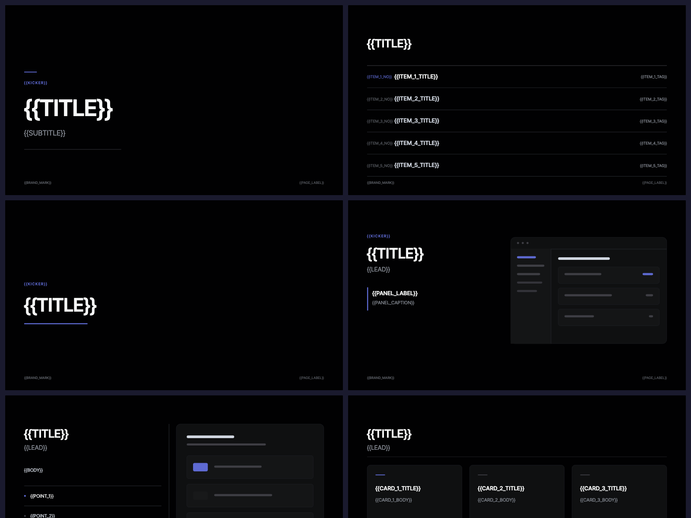
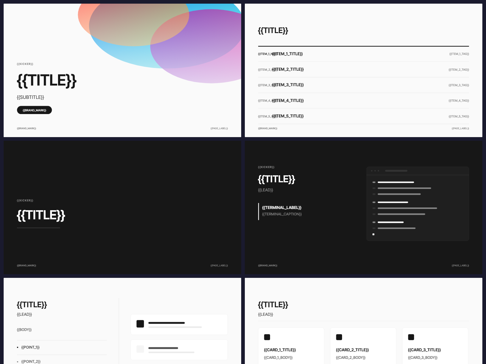
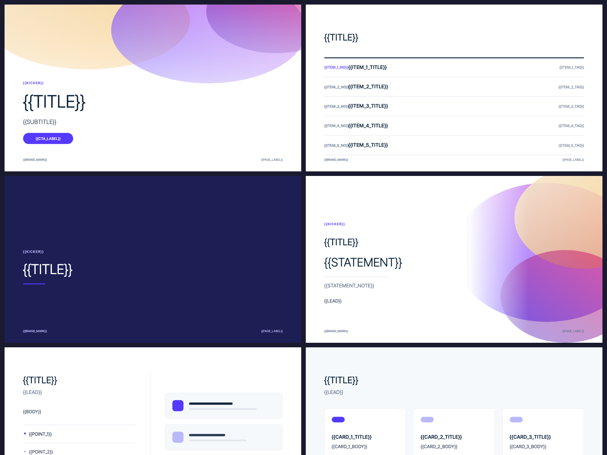
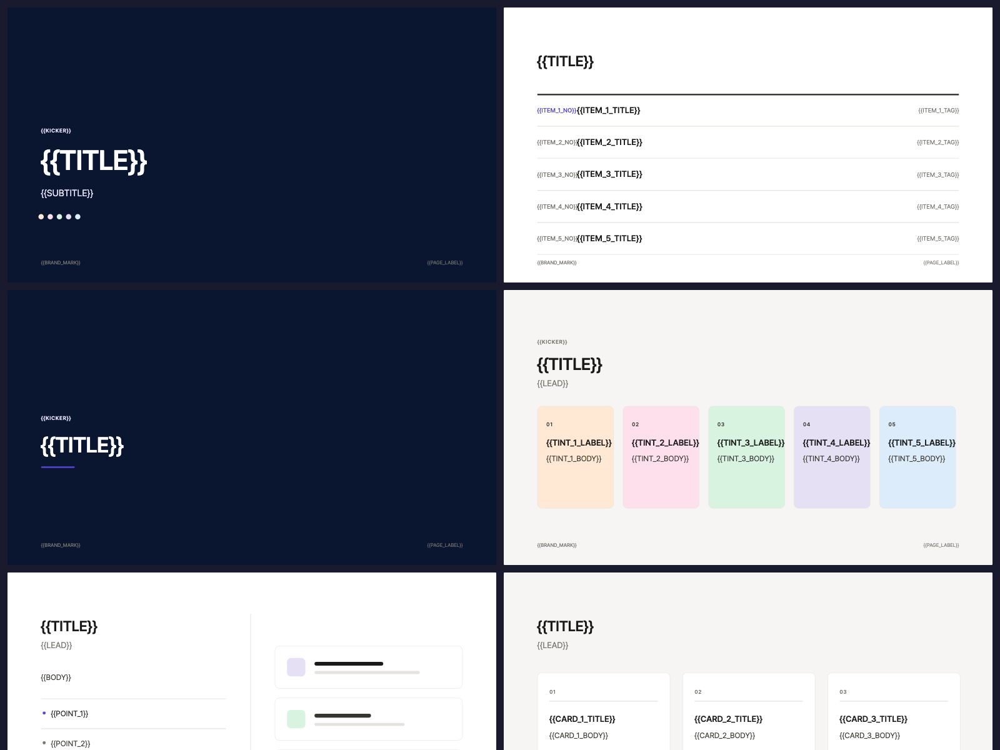
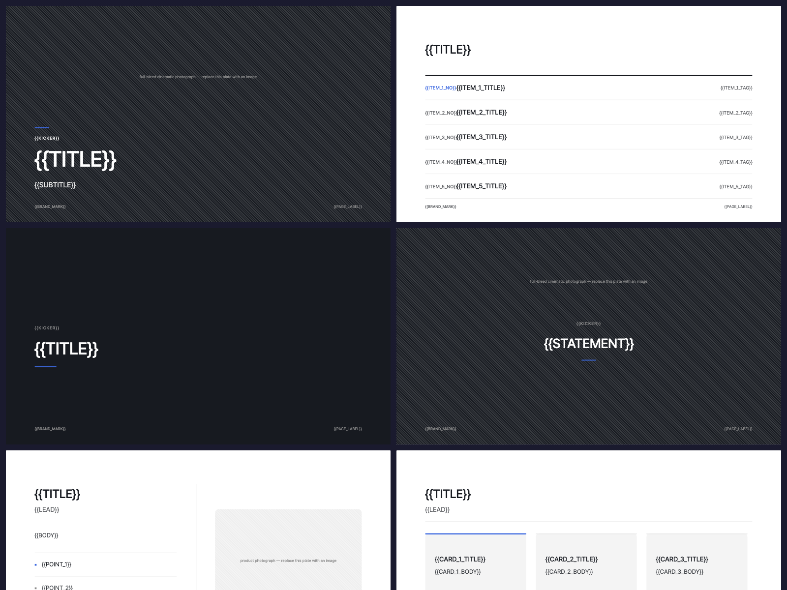
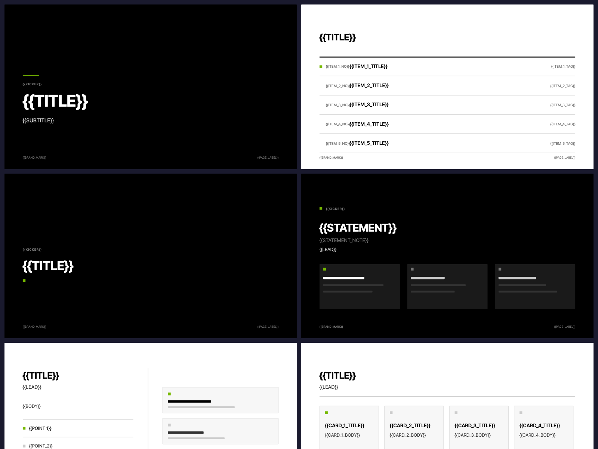
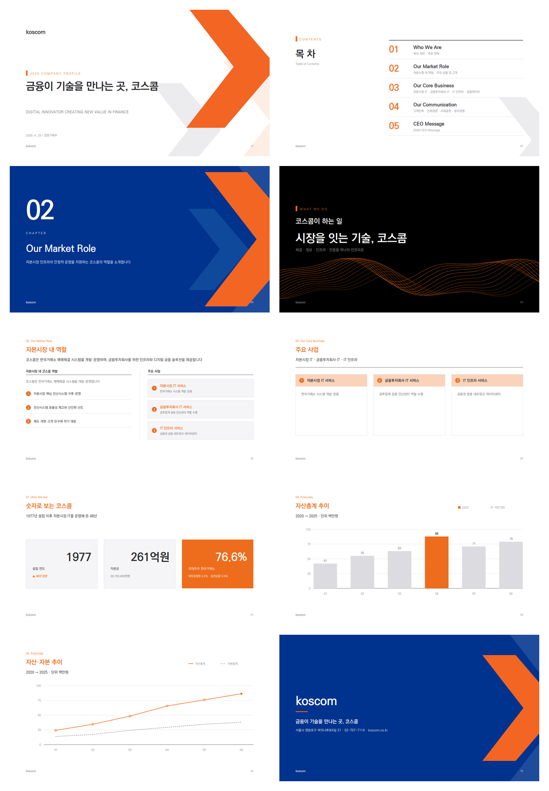

# Deck Design Pack — 클론 하나로 끝나는 프레젠테이션 워크스페이스

[-217346)](#자주-묻는-것)
[](#11개-덱-템플릿)
[](LICENSE)

문서를 넣으면 **PowerPoint에서 도형 하나하나 클릭해서 고칠 수 있는 네이티브 `.pptx`** 가 나옵니다. 그 워크플로우([ppt-master](https://github.com/hugohe3/ppt-master) 계열)가 이 저장소 안에 그대로 들어 있고, 여기에 **직접 디자인한 16:9 템플릿 7종**이 이미 설치·등록된 상태입니다.

받아야 할 두 번째 저장소도, 템플릿 설치 단계도 없습니다.

```
덱 템플릿 11종 · 브랜드 아이덴티티 13종 · 이 팩이 직접 그린 SVG 프로토타입 70장
입력: PDF · DOCX · 웹 URL · Markdown · 엑셀/CSV — 또는 주제 한 줄
출력: projects/<프로젝트>/exports/<제목>_ver1.pptx — 이미지가 아니라 진짜 DrawingML 도형·텍스트·차트
```

---

## 빠른 시작

**1. Python 3.10+** — [python.org](https://www.python.org/downloads/)에서 설치할 때 **"Add to PATH" 체크**. Windows는 [단계별 가이드](docs/windows-installation.md) 참고.

**2. 저장소 받기**

```bash
git clone https://github.com/humanist96/deck-design-pack.git
cd deck-design-pack
pip install -r requirements.txt
```

**3. 에이전트에서 폴더 열기** — [Claude Code](https://claude.ai/code)가 가장 많이 검증된 환경입니다. **Codex도 별도 설정 없이 동작**합니다 ([`AGENTS.md`](AGENTS.md)와 `.codex/skills/` 스텁이 저장소에 이미 있습니다). Cursor, VS Code Copilot 등 파일 읽기·쓰기와 명령 실행이 되는 에이전트면 됩니다.

**4. 그냥 시키기**

> "projects/ 에 넣어둔 3분기 보고서 PDF로 임원 보고용 PPT 만들어줘"

에이전트가 자료를 읽고 → 브라우저 확인 페이지에서 캔버스·페이지 수·색·폰트와 **11종 덱 템플릿 중 하나**를 함께 고르고 → 페이지를 SVG로 한 장씩 그린 뒤 → 겹침·넘침을 자동 검출하고 → 네이티브 `.pptx`로 컴파일합니다.

전체 워크플로우 설명, 선택 사항인 AI 이미지 생성·음성 나레이션 설정: [`docs/slide-master-README.md`](docs/slide-master-README.md) · [`docs/getting-started.md`](docs/getting-started.md) · [`docs/faq.md`](docs/faq.md)

---

## 다른 AI PPT 도구와 뭐가 다른가

**PowerPoint에서 열어서 고칠 수 없으면 PPT가 아니다** — 이 워크플로우의 기본 철학입니다.

| 방식 | 결과물 | 요소별 편집? |
|---|---|:---:|
| 템플릿 채우기형 | 고정 템플릿에 텍스트만 채운 PPTX | 템플릿 한계 안에서만 |
| 이미지형 | 슬라이드 = 큰 그림 한 장 | ❌ |
| HTML형 | 웹 기반 슬라이드 | ❌ PPTX가 아님 |
| **네이티브 편집형 (이 저장소)** | **진짜 DrawingML 도형·텍스트·차트** | ✅ 아무 요소나 클릭해서 편집 |

데이터는 로컬에 남고(모델과의 통신 제외), 비용은 내가 쓰는 AI 모델 사용료뿐이며, 특정 플랫폼에 묶이지 않습니다.

> **만능은 아닙니다.** 결과 품질의 천장은 모델이 정합니다. 한 번에 완벽한 덱을 기대하기보다, 지루한 작업 대부분을 에이전트가 해오고 마지막 다듬기는 편집 가능한 PPTX 위에서 직접 하는 도구로 보는 게 정확합니다.

---

## 11개 덱 템플릿

### 이 팩이 직접 디자인한 7종

| 템플릿 | 테마 | 주조색 | 시그니처 | 어울리는 자리 |
|---|---|---|---|---|
| **[Midnight Panel](.claude/skills/ppt-master/templates/decks/midnight-panel/)** | 다크 | `#5E6AD2` | 그림자 대신 **서피스 계단**으로 깊이, 페이지당 라벤더 시그널 하나 | 제품 로드맵, 스프린트 리뷰, 엔지니어링 브리핑 |
| **[Polarity Mono](.claude/skills/ppt-master/templates/decks/polarity/)** | 라이트 ↔ 다크 | `#171717` | 챕터 구분이 구분선이 아니라 **배경 극성 반전** | 기술 발표, 데모데이, 개발자 컨퍼런스 |
| **[Gradient Mesh Fintech](.claude/skills/ppt-master/templates/decks/gradient-mesh/)** | 라이트 | `#533AFD` | 메시 그라디언트 위 300 웨이트 얇은 디스플레이 타입 | 파트너 제안서, 핀테크 IR, 제품 이코노믹스 |
| **[Warm Document](.claude/skills/ppt-master/templates/decks/warm-doc/)** | 웜 라이트 | `#5645D4` | 1px 아웃라인 문법, 파스텔 틴트 카드 5색 | 사내 핸드북, 온보딩, 팀 위키 발표 |
| **[Open Road](.claude/skills/ppt-master/templates/decks/open-road/)** | 라이트 + 카본 | `#3E6AE1` | 한 페이지 한 메시지, 풀블리드 사진 | 제품 런칭, 브랜드 키노트, 비전 발표 |
| **[Signal Green](.claude/skills/ppt-master/templates/decks/signal-green/)** | 블랙 / 화이트 | `#76B900` | 12×12 코너 스퀘어 표식, 각진 2px 지오메트리 | AI·GPU 브리핑, 벤치마크, 개발자 세션 |
| **[Koscom Chevron](.claude/skills/ppt-master/templates/decks/koscom-chevron/)** | 화이트 + 네이비 + 블랙 | `#EE6D1D` | 앵커 페이지의 오렌지 셰브론(›) 클러스터, KoPub돋움체 Bold 헤드라인 | 코스콤 회사소개, 사업 브리핑, 자본시장 IT 제안 |

### 워크플로우에 함께 들어 있는 4종

| 템플릿 | 페이지 | 주조색 | 용도 |
|---|---|---|---|
| **[apple](.claude/skills/ppt-master/templates/decks/apple/)** | 13 | `#1D1D1F` | 제품 발표, 브랜드 스토리, 디자인 리뷰 |
| **[mckinsey](.claude/skills/ppt-master/templates/decks/mckinsey/)** | 10 | `#0F2A4A` | 전략 보고서, 시장·산업 분석, 실행 로드맵 |
| **[naver_ir](.claude/skills/ppt-master/templates/decks/naver_ir/)** | 7 | `#03C75A` | 분기 실적발표, 재무 보고, 투자자 미팅 |
| **[jangpm](.claude/skills/ppt-master/templates/decks/jangpm/)** | 4 | `#4633E3` | 강의, 워크숍, 분석 리포트 |

### 브랜드 아이덴티티 13종

페이지 로스터 없이 **색·타이포·보이스·아이콘 규칙만** 담은 프리셋입니다. 룩은 가져오되 페이지 구조는 직접 짜고 싶을 때 씁니다 → [`templates/brands/`](.claude/skills/ppt-master/templates/brands/)

덱과 브랜드 모두 파이프라인이 읽는 인덱스 파일로 발견됩니다: [`decks_index.json`](.claude/skills/ppt-master/templates/decks/decks_index.json) · [`brands_index.json`](.claude/skills/ppt-master/templates/brands/brands_index.json)

---

## 갤러리

| | |
|---|---|
| **Midnight Panel**<br> | **Polarity Mono**<br> |
| **Gradient Mesh Fintech**<br> | **Warm Document**<br> |
| **Open Road**<br> | **Signal Green**<br> |
| **Koscom Chevron**<br> | |

원본 크기 컨택트 시트: [`previews/`](previews/) · 템플릿별 상세: [`docs/gallery.md`](docs/gallery.md)

---

## 저장소 구조

```
.claude/skills/            워크플로우 본체
  ppt-master/                메인 SVG 파이프라인
    scripts/                 Python 진입점 54개 — SVG→PPTX 변환, 품질 검사기,
                               확인 UI, 이미지 백엔드, TTS, 내보낸 PPTX 검증
    templates/
      decks/                 덱 템플릿 11종 + decks_index.json
      brands/                브랜드 아이덴티티 13종 + brands_index.json
      layouts/               레이아웃 템플릿 7종
      charts/                차트 템플릿 79개
      icons/                 아이콘 11,632개 (tabler, phosphor, simple-icons 등 5세트)
    assets/fonts/            Pretendard (SIL OFL)
    references/ workflows/   역할 정의·기술 명세·독립 워크플로우
  diagram-design/            다이어그램 14종 작성 스킬
  codex-image/               이미지 생성 스킬
  native-enhance-pptx/       완성된 PPTX 후처리
  ppt-template-fill/         기존 PPTX 템플릿 채우기
.codex/skills/             Codex 발견용 스텁 (자동 생성, 손으로 고치지 말 것)
projects/                  내 덱과 원본 자료 (git 추적 제외)
previews/                  이 팩 7종의 컨택트 시트
docs/                      워크플로우 가이드 + 이 팩의 작성 규칙
install.py                 이 팩을 *다른* ppt-master 워크스페이스로 내보내기
```

### 팩 템플릿 한 종의 구성

```
.claude/skills/ppt-master/templates/decks/<id>/templates/
├── design_spec.md          # 잠근 팔레트, 타입 램프, 페이지 로스터, 안티패턴
├── 01_cover.svg            # ─┐
├── 02_agenda.svg           #  │
├── 03_section.svg          #  │
├── 04_<시그니처>.svg        #  │ {{TOKEN}} 슬롯을 가진
├── 05_two_column.svg       #  │ 페이지 프로토타입 10장
├── 06_card_grid.svg        #  │
├── 07_metrics.svg          #  │
├── 08_chart_bar.svg        #  │
├── 09_chart_line.svg       #  │
└── 10_closing.svg          # ─┘
```

7종이 같은 10페이지 척추를 공유해서 팩 전체가 하나의 시스템으로 읽힙니다. **4번 페이지가 각 템플릿의 정체성이 드러나는 자리**입니다 — 프로덕트 패널, 극성 반전, 그라디언트 진술문, 틴트 카드 스택, 풀블리드 히어로, 블랙 히어로, 블랙 웨이브 필드.

각 `design_spec.md`는 "조립한 것"이 아니라 "디자인한 것"으로 보이게 만드는 것들을 잠급니다: 색을 남김없이 나열한 목록(여기 없는 색은 생성된 SVG에 나올 수 없음), 일반 기본값을 덮어쓰는 고유 본문 크기 기준선, 차트 문법, 그리고 작성 시점에 거부당하도록 쓴 안티패턴 체크리스트.

---

## 구조 계약

이 SVG들은 장식이 아닙니다. 각 페이지가 자신이 컴파일될 PowerPoint 구조를 선언합니다.

- 루트 Master/Layout 식별자 (`data-pptx-master`, `data-pptx-layout`)
- 고정 프레이밍은 Layout 원자로 (`data-pptx-layer="layout"`)
- 콘텐츠 슬롯은 캐리어가 정확히 하나인 경계 지어진 플레이스홀더로
- 차트 페이지에는 `<!-- chart-plot-area: … -->` 마커

10페이지 템플릿은 **Master 1개 + Layout 9개**로 컴파일됩니다 — 차트 두 페이지는 고정 프레이밍과 슬롯 계약이 동일해서 `chart_linear` 레이아웃 하나를 공유합니다.

### 검증 결과

| 게이트 | 결과 |
|---|---|
| `svg_quality_checker --template-mode` | 70/70 페이지 · **0 errors**. 60페이지 완전 클린 |
| ↳ `koscom-chevron` 경고 10건 | 10페이지 각 1건 — KoPub돋움체가 검사기의 PPT-safe 폰트 목록에 없어서 나오는 **예정된 경고**. 코스콤 서체 락을 지키는 대가이며 [`FONTS.md`](.claude/skills/ppt-master/templates/decks/koscom-chevron/fonts/FONTS.md)에 문서화되어 있습니다 |
| `template_preview_pptx.py` 리드백 | 10 slides · 1 master · 9 layouts |
| 엔드투엔드 덱 생성 (`strict` 준수) | 0 errors, 0 warnings · `verify_deck` PASS |
| 내보낸 패키지 | master 1개 · 레이아웃 선택기 이름 보존 · 플레이스홀더 바인딩 |

기존 6종은 구조만이 아니라 **끝까지** 검증했습니다: 각 템플릿에서 `strict` 준수로 7페이지 덱을 생성해(표지·목차·챕터·시그니처 페이지·지표·실제 데이터 차트·클로징) 내보낸 패키지가 PowerPoint 레이아웃 선택기에 그 템플릿의 이름으로 뜨는 것까지 확인했습니다. `koscom-chevron`은 구조 검사가 깨끗하고 컨택트 시트도 렌더했지만, 아직 `verify_deck`까지는 돌리지 않았습니다.

작성 규칙: [`docs/authoring.md`](docs/authoring.md) · 템플릿 데이터 모델: [`docs/templates-architecture.md`](docs/templates-architecture.md)

---

## 타이포그래피

기존 6종은 **Pretendard**(SIL OFL) 하나로 잠겨 있고, 폰트는 [`assets/fonts/Pretendard/`](.claude/skills/ppt-master/assets/fonts/Pretendard/)에 번들되어 있습니다. `koscom-chevron`만 예외로, 코스콤 공식 자료의 **KoPub돋움체** 락을 유지하며 세 웨이트를 [`decks/koscom-chevron/fonts/`](.claude/skills/ppt-master/templates/decks/koscom-chevron/fonts/FONTS.md)에 함께 넣었습니다.

위계는 폰트 가족을 바꿔서 만들지 않습니다 — 굵기 폭, 자간, 크기 램프로만 만듭니다.

각 스펙의 자간 값은 라틴 기준이며, **한글이 지배적인 구간은 ×0.5로 완화**합니다. 한글은 글자폭이 균일해서 같은 음수 자간이 글자를 뭉개기 때문입니다.

> PPTX는 폰트를 내장하지 않습니다. 덱을 여는 모든 컴퓨터에 Pretendard가, `koscom-chevron`이라면 KoPub돋움체까지 설치되어 있어야 합니다.

---

## 이미 쓰는 워크스페이스에 이 팩만 넣기

자기 ppt-master 워크스페이스를 이미 운영 중이고 여기 템플릿 7종만 가져가고 싶다면, `install.py`가 복사하고 그쪽 워크스페이스의 인덱스 두 개를 병합해 줍니다.

```bash
python3 install.py /path/to/your/ppt-master-workspace
python3 install.py <workspace> --only midnight-panel polarity   # 일부만
python3 install.py <workspace> --force                          # 기존 id 교체
python3 install.py <workspace> --dry-run                        # 계획만 출력
```

표준 라이브러리 외 의존성이 없습니다(PyYAML이 있으면 씁니다). 대상은 `.claude/skills/ppt-master/templates/`를 가진 디렉터리여야 하고, **이 저장소 자신을 대상으로 지정하면 거부**합니다 — 여기엔 이미 설치돼 있으니까요. 상세: [`docs/install.md`](docs/install.md)

> **왜 워크스페이스의 등록기를 안 쓰고 별도 설치 스크립트인가?** 기본 `register_template.py`는 인덱스 항목을 매번 처음부터 다시 만들면서, 확인 UI가 덱의 1단계 앵커(mode / visual_style / delivery_purpose)를 자동 반영할 때 읽는 `defaults` 블록을 떨어뜨립니다. `install.py`는 그 블록을 각 템플릿 자신의 frontmatter에서 가져오므로, 인덱스를 몇 번을 다시 만들어도 앵커가 살아남습니다.

---

## 자주 묻는 것

**Q. 이미지가 아니라 진짜 편집되는 게 맞나요?** 네. 도형·텍스트·차트가 DrawingML 개체로 나갑니다. 4페이지 차트를 막대로 바꾸는 것도 PowerPoint에서 직접 하거나 채팅으로 시키면 됩니다.

**Q. 인터넷 없이 되나요?** AI 모델 호출을 빼면 전 과정이 로컬에서 돕니다.

**Q. 내보낸 PPTX를 자동 점검할 수 있나요?** [OfficeCLI](https://github.com/iOfficeAI/OfficeCLI)를 설치하면 패키지 무결성·텍스트 넘침·렌더링을 검사합니다. Windows에 PowerPoint가 있으면 검증 스크린샷이 실제 PowerPoint 렌더링으로 찍힙니다.

더 많은 문답: [`docs/faq.md`](docs/faq.md) · 왜 이렇게 만들었는지: [`docs/why-ppt-master.md`](docs/why-ppt-master.md) · 기술 설계: [`docs/technical-design.md`](docs/technical-design.md) · 음성 나레이션: [`docs/audio-narration.md`](docs/audio-narration.md)

---

## 라이선스 · 크레딧 · 상표

이 팩이 만든 것 — 덱 템플릿 7종, 브랜드 프리셋 7종, 컨택트 시트, `install.py` — 는 [MIT](LICENSE) © 2026 humanist96.

임베딩된 워크플로우는 [MIT](THIRD_PARTY_NOTICES.md) © 2025-2026 Hugo He이며, [hugohe3/ppt-master](https://github.com/hugohe3/ppt-master)를 한국어 작업에 맞게 커스터마이즈한 [byungjunjang/slide-master](https://github.com/byungjunjang/slide-master)에서 가져왔습니다. 원 저장소의 README는 [`docs/slide-master-README.md`](docs/slide-master-README.md)에 원문 그대로 보존했습니다. 폰트와 스킬별 라이선스는 [`THIRD_PARTY_NOTICES.md`](THIRD_PARTY_NOTICES.md)에 정리되어 있습니다.

기존 6종 템플릿은 제3자의 상표·로고·워드마크·사진을 일절 번들하지 않습니다. `koscom-chevron`은 코스콤 자사 샘플 덱을 바탕으로 만든 하우스 템플릿입니다 — 코스콤 이름과 셰브론 마크는 코스콤(주)의 것이고, **로고 이미지는 번들하지 않으며**(텍스트 `{{BRAND_MARK}}` 슬롯만), 함께 넣은 KoPub 폰트는 자체 무료 라이선스를 따릅니다. 스펙이 특정 회사를 언급하는 경우, 그것은 디자인 *어법*을 참조점으로 식별하는 서술적 비교이지 보증이나 제휴 주장이 아닙니다. 전체 입장: [`TRADEMARKS.md`](TRADEMARKS.md)
